# Going for Gold!

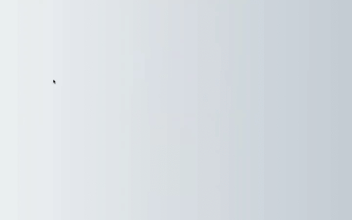

#### [Live link to deployed project](https://going-for-gold.netlify.app/)

[Going for Gold](https://going-for-gold.netlify.app/) offers a fairer, more measured look at the Tokyo 2020 Olympic medal count. Countries are ranked in relative (per capita) instead of absolute medal-winning terms. Site visitors can toggle between two different ranking breakdowns, as well as search for countries, contact the site owner and enable dark mode. Fully interactive and boasting a robust and coherent mobile-first design, Going for Gold makes clever use of the React ecosystem to give users a richly dynamic UI. The application leverages the REST Countries API as well as a local JSON Olympic dataset to render lightning-fast statistical analyses. React Context API and EmailJS integration - the latter bolstered by custom form validation and error handling - round out a distinctly memorable user experience.

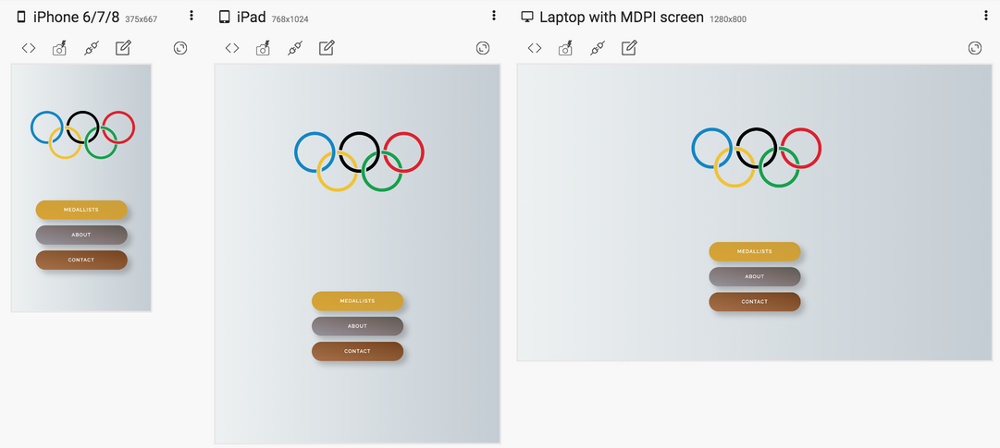

## User Experience (UX)

It is imperative in today's on-the-move, remote-working consumer landscape that an interactive frontend site such as Going for Gold be fully-responsive across a wide range of devices and screen sizes. This overarching principle, coupled with a desire to create something sleek and modern-looking, informed my work from the first design sketch right through to the full production build. In terms of conceptual inspiration, my initial 'Eureka moment' arrived after coming across [this thought-provoking Olympic-themed LinkedIn post](https://www.linkedin.com/feed/update/urn:li:activity:6830398833353117697/). Added to the fact that the Tokyo Games themselves had just concluded, this sent me down a rabbit hole of Olympics-related data, blog posts and visualisations of various kinds until a clear theme for the site began to emerge. [React](https://reactjs.org/), together with a selection of its tributary libraries and dependencies, was chosen to power things under the hood, as its speed and versatility when it comes to rendering (and rerendering) user interfaces is second to none. I chose to go it alone in terms of design/styling, so no frameworks like Bootstrap or Tailwind CSS were used anywhere in the application's stylesheet. The project's title, meanwhile, is of course a respectful nod to [the greatest TV game show of all time](https://www.youtube.com/watch?v=lTjVNwYRCNk)

## Project design

### Colour scheme:

  

  <b>click to view</b>
  

In some respects, the choices for the site's colour scheme were somewhat ready-made, as I decided from the off to incorporate the five instantly-recognisable colours found in the [Olympic rings logo](https://en.wikipedia.org/wiki/Olympic_symbols#Rings), as well as an approximate shade to represent each medal colour (gold, silver and bronze). Similarly, the navy blue colour used extensively as a background/secondary colour throughout the site is taken from the ['Harmonised chequered emblem'](https://olympics.com/tokyo-2020/en/games/emblem/) designed by Japanese artist Asao Tokolo and chosen as the Games' official logo.

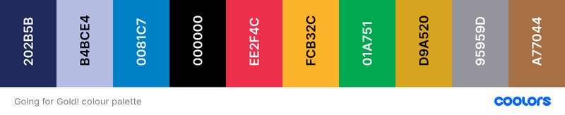

### Typography:

  

  <b>click to view</b>
  

The official Tokyo 2020 font was developed by [Morisawa](https://olympics.com/tokyo-2020/en/news/morisawa-official-font-tokyo-2020), a Japanese type foundry, and appears to be unavailable for public use. After a bit of digging, I therefore decided to use the [Freeroad Regular font](https://webfonts.ffonts.net/Freeroad-Regular.font), which is a close approximation of the ["industrial `sans serif`"](https://fontmeme.com/images/TOKYO-2020-NEW.gif) seen in the Games' [(redesigned)](https://www.theguardian.com/sport/2016/apr/25/tokyo-2020-organisers-unveil-new-logo-olympic-plagiarism-allegations) [logo](https://fontmeme.com/images/TOKYO-2020-NEW.gif), for all primary headings across the site. To complement this, I chose [Raleway](https://fonts.google.com/specimen/Raleway?query=raleway), a popular `sans serif` font available via Google Fonts, as the default `body` font.

### Wireframes:

  

  <b>click to view</b>
  

## Features

### Existing features:

- #### [Landing page:](https://going-for-gold.netlify.app/)

  

  <b>click to view</b>
  

As showcased in the images above, the first thing the user sees upon landing is a visually appealing Olympic rings logo animation (lasting approximately four seconds), followed by a further trickle-down/fade-in animation effect involving a trio of call-to-action buttons (one representing each Olympic medal category of gold ('MEDALLISTS'), silver ('ABOUT') and bronze ('CONTACT')). These three buttons are centred on all screen sizes, and act as de facto navigational aids in lieu of the site's actual navigation menu (which has been hidden here in an effort not to overload visitors with too much information within the first few seconds). Clicking on any one of these CTA buttons takes the user to the page denoted by the button text.

- #### [Medallists page:](https://going-for-gold.netlify.app/medallists)

  

    

    <b>click to view</b>
    

  | 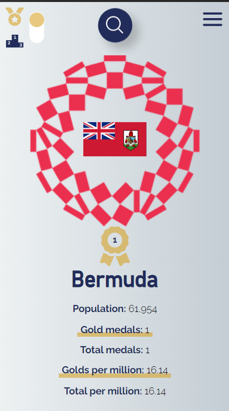 | 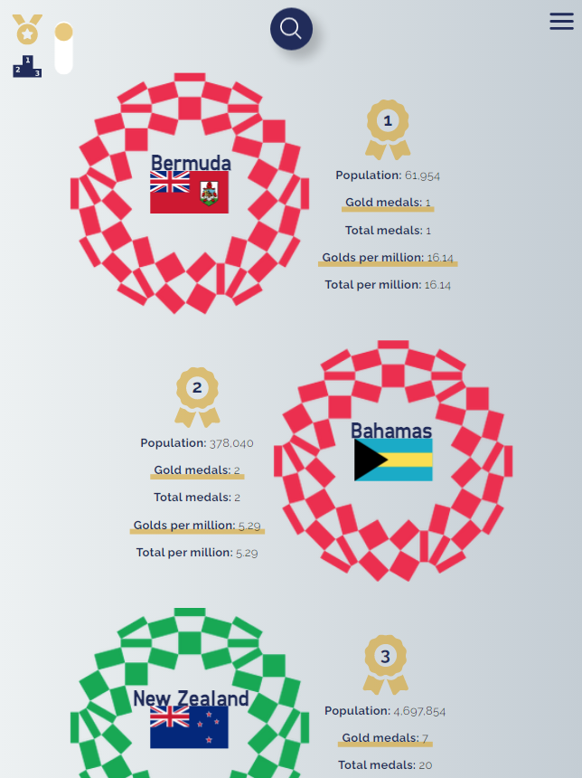 | 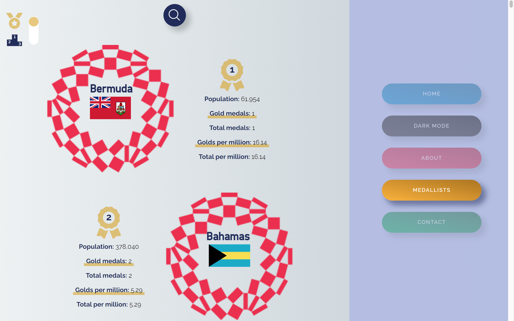 |
  | :------------------------------------------------: | :------------------------------------------------: | :-------------------------------------------------: |
  |                       mobile                       |                       tablet                       |                       desktop                       |

The Medallists page is the site's main page content-wise. In its default state, it gives a list of all 93 medal-winning countries from the Tokyo Games with a breakdown of the following data for each individual country:

- National flag (pulled from a REST Countries API endpoint)
- Country name (as above)
- Population (as above)
- Gold medals won at Tokyo 2020 (taken from the app's local data file)
- Gold medals per one million citizens (calculated from the two relevant figures above)
- Total medals won at Tokyo 2020 (taken from the app's local data file)
- Total medals per one million citizens (calculated from the two relevant figures above)

| 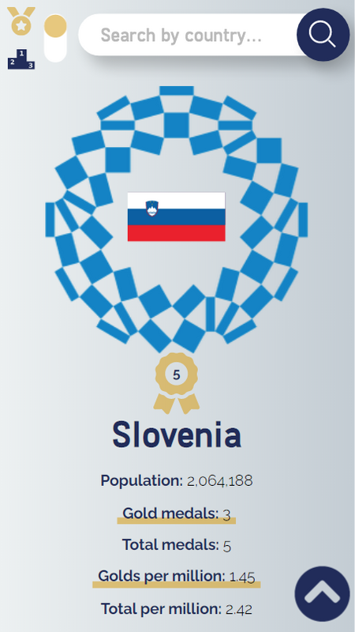 |  | 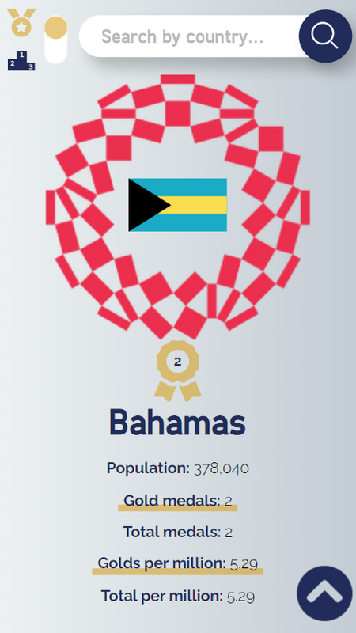 | 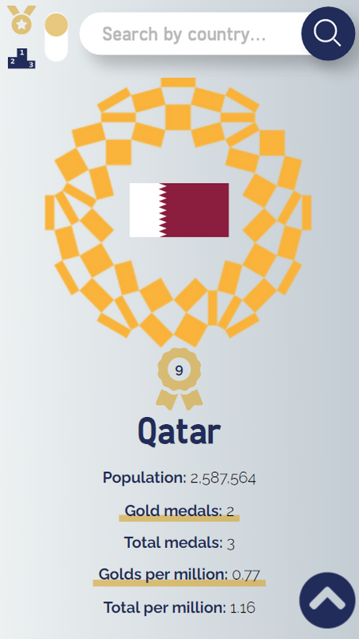 | 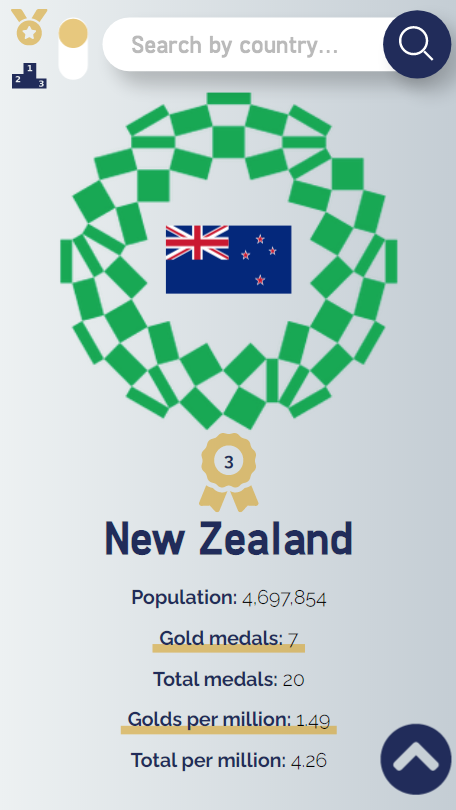 |
| :---------------------------------------------------: | :---------------------------------------------------: | :-----------------------------------------------------: | :-------------------------------------------------: | :----------------------------------------------------: |
|                     blue (Europe)                     |                    black (Africa)                     |                     red (Americas)                      |                    yellow (Asia)                    |                    green (Oceania)                     |

In addition to this, the UI for each medallist includes a dynamically-rendered background image consisting of the aforementioned Tokyo 2020 emblem in the relevant Olympic ring colour that corresponds to that country's continent. Initially, these `.container-flag` elements were being differentially coloured based on their index number (using array iteration). It was actually my mentor Tim who alerted me to the fact that the five Olympic ring colours [represent the five main continents](https://en.wikipedia.org/wiki/Olympic_symbols#:~:text=The%201949%E2%80%9350%20edition%20of,%2C%20and%20red%20for%20America%22). After learning of this, I was able to conditionally target the `background-image` property of each of these elements based on the "region" property value of each corresponding item returned from the REST Countries API endpoint.

| 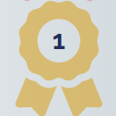 |
| :-------------------------------------------------: |
|                    `<FaAward />`                    |

One more feature displayed for each medallist is a dynamically-rendered React Icon with numerical ranking corresponding to that particular country's standing (these values are bound to the index of each country when iterating through the overall array)

- #### [About page:](https://going-for-gold.netlify.app/about)

  

    

    <b>click to view</b>
    

  | 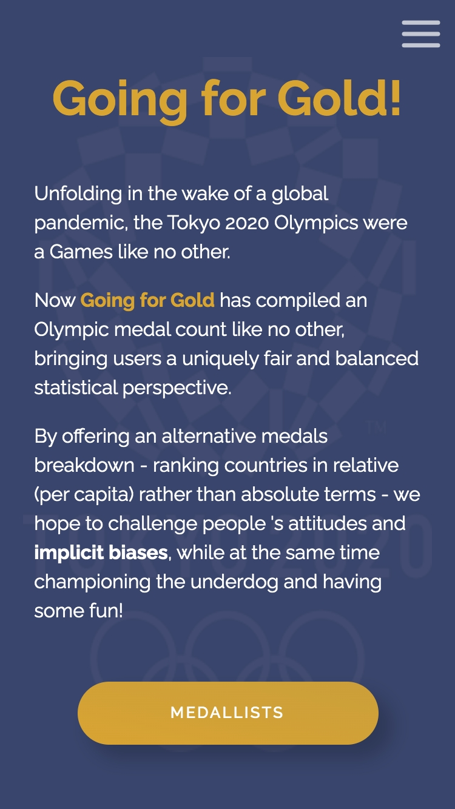 | 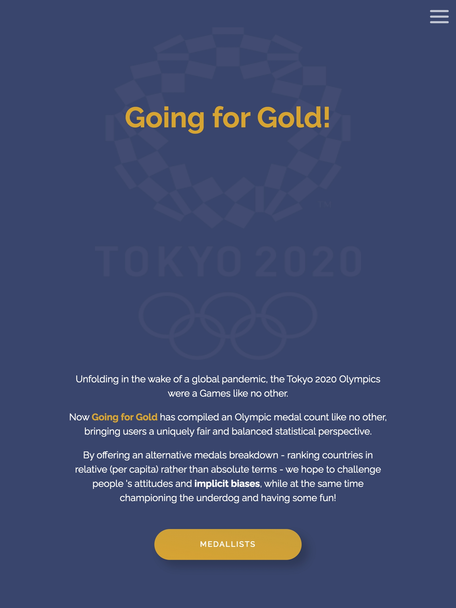 | 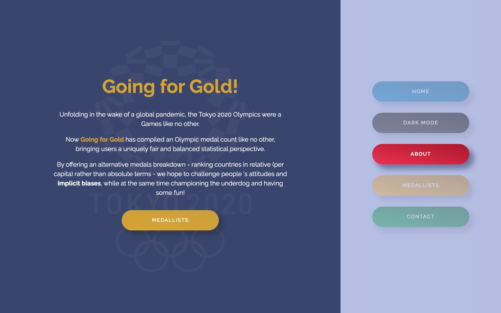 |
  | :----------------------------------------------: | :----------------------------------------------: | :-----------------------------------------------: |
  |                      mobile                      |                      tablet                      |                      desktop                      |

As you might expect, the site's About page presents users with a brief rundown on the site's purpose and intentions - all done in an engaging and aesthetically-pleasing manner. The parent `.container-about` element has been styled with a faint Tokyo 2020 logo `background-image`, while the page's main UI elements (heading, paragraphs of text and a bright CTA button) all transition into view thanks to staggered CSS `animation` effects on tablet and desktop (see image below)

| 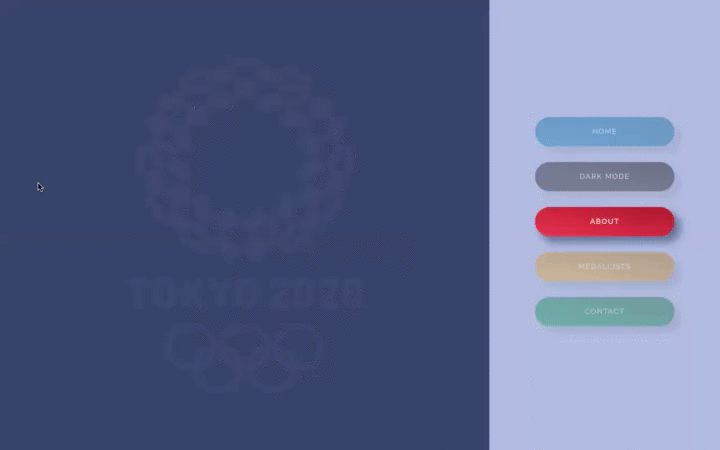 |
| :---------------------------------------------------------------------: |
|                          About page animation                           |

- #### Navigation:

  - ##### Fixed Navigation Bar:
  

  

  <b>click to view</b>
  

  |  |  |  |
  | :-------------------------------------------------: | :-------------------------------------------------: | :-------------------------------------------------: |
  |                       mobile                        |                       tablet                        |                       desktop                       |

  - There is a full-width nav bar fixed to the top of the viewport on all device sizes
  - The site's core navigation menu is hidden off-canvas initially to create a spacious feel across the landing area, where the user is greeted by the Brew Barberista `.navbar-logo` on the left-hand side and a `.navbar-toggler` button (aka 'hamburger icon') to the right
  - This logo is a modified version of the one featured in the nav bar of [the business's existing website](http://brewbarberista.ie/)
  - The [dark blue and gold colours that make up this logo](http://brewbarberista.ie/resources/Circular%20logo.jpg) directly inform this project's primary palette. A lighter shade of 'queen blue' [(featured throughout the current site's `footer`, for instance)](https://loosenthedark.tech/brew-barberista#contact) is taken directly from [the premises' brightly-painted shopfront](https://www.facebook.com/photo/?fbid=190590879506085&set=a.190590812839425).
  

  - ##### (Off-Canvas) Navigation Menu:

  

  

  <b>click to view</b>
  

  |  |  |  |
  | :----------------------------------------------------: | :----------------------------------------------------: | :-----------------------------------------------------: |
  |                         mobile                         |                         tablet                         |                         desktop                         |

  - The off-canvas `navbar-nav` menu mentioned above can be expanded by clicking on the `.navbar-toggler` button. This functionality has been enabled using custom JavaScript by listening for a relevant user click(s) and sliding the `.navbar-nav` into the viewport with CSS class toggling involving `absolute` positioning and appropriate transition effects. In addition, the icon comprising the `.navbar-toggler` button [animates on click](docs/images/screenshots/nav/nav-toggler-icons-animation.gif) to produce a dynamic yet smooth transition that is both distinctive and pleasing to the eye.
  - The expanded polygon-shaped menu contains links to each of the website's six internal sections containing content (see below), as well as a seventh link entitled 'Press'.
  - Clicking on this 'Press' link triggers an additional absolutely-positioned submenu featuring external links to recent Brew Barberista media appearances. Each of these links opens in a new browser tab due to the `<a>` tag's `target` property being set to `_blank`.
  - The bottom 'Contact' link consists of a blue call-to-action `button`. In keeping with UX best practices, clicking on any of the links embedded in the `.navbar-nav` will cause the menu to revert to its default off-canvas location as the site navigates to the designated location. Smooth scrolling has been enabled to streamline the navigation experience through use of the `scroll-behavior: smooth;` CSS rule on the document's `body` element.
  - It's worth noting that one further section of the site, a tiled image gallery, is purely decorative, and so no anchor link was deemed necessary.

  |  |  |  |
  | :----------------------------------------------------: | :----------------------------------------------------: | :-----------------------------------------------------: |
  |                         mobile                         |                         tablet                         |                         desktop                         |

  

- #### [Header:](https://loosenthedark.tech/brew-barberista)

  

  <b>click to view</b>
  

|  |  |
| :---------------------------------------------------------: | :--------------------------------------------------------: |
|                `<header>` HTML code snippet                 |      `.hero-header` and `.overlay` CSS code snippets       |

|  |  |  |
| :---------------------------------------------------: | :---------------------------------------------------: | :----------------------------------------------------: |
|                        mobile                         |                        tablet                         |                        desktop                         |

- ##### Mobile & Tablet (< 992px):

  - The site's above-the-fold real estate on mobile and tablet features a clean, soothing background image of a horizon out to sea. This was chosen due to Brew Barberista's prime [location](https://loosenthedark.tech/brew-barberista/#location) just off the Howth Road in Raheny, less than a kilometre uphill from the Dublin Bay coast road.
  - On page load this landing area is brought to life using animated hero icons: one a [takeaway cup of hot coffee](static/images/icons/icon-coffee-takeaway.svg), the other a [silhouette of a man with a striking hairstyle](static/images/icons/icon-silhouette.svg). These icons have been enlarged and had a 'zoom-into-view' `@keyframes icon-reveal` animation effect applied to them in order to capture the visitor's attention and hint at the services available at Brew Barberista.
  - There is also a gold-coloured downward-pointing chevron icon used to hook the user and encourage them to explore below the fold. This functionality has been enhanced by adding a gentle `@keyframes bobbing` animation effect in the project's stylesheet

- ##### Desktop (> 991px):

      - A decision was made to change the `header` area's aesthetic on desktop devices. In place of the background image with animated icons are two short complementary video backgrounds: one showing [a barista pouring a cup of coffee](static/videos/bg-barista-pour.mp4), the other featuring [a closeup of a barber trimming a customer's hair](static/videos/bg-barber.mp4).
      - Both of these `video` elements have had their `opacity` reduced to keep them from being seen to occupy the foreground (and/or overly distract the user from the site's main content).
      - There has also been an `.overlay` class applied to an absolutely-positioned `div` element that acts as a subtle filter in line with the site's prevailing colour palette
      - One more additional `div` with `background-color` set to semi-opaque blue has had a `clip-path` rule applied to it. This has the effect of creating a symmetrical pair of roughly triangular 'corner areas', each containing an icon and a heading, which act as navigation links to 'Brew Coffee' and 'Brew Barber', respectively.

  

- #### [Main:](https://loosenthedark.tech/brew-barberista/#about)

  - ###### [About `section`:](https://loosenthedark.tech/brew-barberista/#about)
  

  

  <b>click to view</b>
  

  |  |  |  |
  | :-------------------------------------------------: | :-------------------------------------------------: | :--------------------------------------------------: |
  |                       mobile                        |                       tablet                        |                       desktop                        |

  - The site's first textual content appears in the area immediately below the `header` (referred to as the About section here for the sake of convenience). This `section` is in turn subdivided into two `div`s, [**Brew Coffee**](https://loosenthedark.tech/brew-barberista/#about) and [**Brew Barber**](https://loosenthedark.tech/brew-barberista/#barber), each accompanied by eye-catching background imagery and short, snappy summaries of the two sides of Brew Barberista's operations.
  

  - ###### [More Info `section`:](https://loosenthedark.tech/brew-barberista/#more-info)
  

  

  <b>click to view</b>
  

  |  |  |  |
  | :---------------------------------------------------------: | :---------------------------------------------------------: | :----------------------------------------------------------: |
  |                           mobile                            |                           tablet                            |                           desktop                            |

  - Each About subsection contains a 'More Info' hyperlink, which brings the user to the relevant follow-on subsection for that Brew Barberista service ([Brew Coffee](https://loosenthedark.tech/brew-barberista/#more-info) / [Brew Barber](https://loosenthedark.tech/brew-barberista/#get-in-touch)).
  - These two More Info subsections are stacked on mobile and tablet, and lie side by side on desktop
  - Each panel contains informative blurbs highlighting a variety of USPs offered by Brew Barberista. The text is set against carefully-positioned full-width and -height background images.
  - As screen width increases and space permits, several (initially hidden) elements are revealed across tablet and desktop devices. These include supplementary paragraphs of text and call-to-action `button`s.
  - The 'OUR PARTNERS' CTA `button` (visible on desktop only) in the [Brew Coffee `div`](https://loosenthedark.tech/brew-barberista/#more-info) directs the user to the [Our Partners `section`](#our-partners-section) of the site, while the 'BOOK NOW' `button` (visible on tablet and desktop) beneath the ['Get in touch' Brew Barber heading](https://loosenthedark.tech/brew-barberista/#get-in-touch) causes the page to scroll right down to the [`footer`](#footer-aka-contact-section), where the business's [contact details](https://loosenthedark.tech/brew-barberista/#contact) can be found.
  

  - ###### [Customer Reviews `section`:](https://loosenthedark.tech/brew-barberista/#customer-reviews)
  

  

  <b>click to view</b>
  

  |  |  |  |
  | :-----------------------------------------------------------------------: | :-----------------------------------------------------------------------: | :------------------------------------------------------------------------: |
  |                                  mobile                                   |                                  tablet                                   |                                  desktop                                   |

  - The Customer Reviews `section` boasts a selection of reviews from Brew Barberista customers, shining a light on what the business has to offer.
  - Each review consists of a customer avatar, excerpt from that customer's review, customer name and the source from which the review has been taken.
  - Semantic HTML elements have been used here: each review is wrapped inside a `figure` element, with nested `img` (avatar), `blockquote` (review body) and `figcaption` (name and review source) elements.

    |  |
    | :-----------------------------------------------------------------------------: |
    |                          `<figure>` HTML code snippet                           |

  - As with several other `section`s, the layout has been achieved using a combination of CSS positioning and flexbox on smaller screens, with CSS grid rules applied on desktop.
  

  - ###### Image gallery:
  

  

  <b>click to view</b>
  

  |  |  |  |
  | :-----------------------------------------------------------------: | :-----------------------------------------------------------------: | :------------------------------------------------------------------: |
  |                               mobile                                |                               tablet                                |                               desktop                                |

  - As stated previously, the (untitled) image gallery is for decorative purposes only
  - A flexible and fluid layout has been achieved with flexbox - more specifically, through use of the `flex-wrap` CSS property
  - The gallery displays as a 2x2 grid on mobile, 3x2 on tablet (two extra image `div`s having had their `display` property toggled from `none` to `block`) and a single row containing four images (each with a `max-height` rule applied when the screen width reaches 1440px) on desktop
  

  - ###### [Our Partners `section`:](https://loosenthedark.tech/brew-barberista/#partners)

  

  

  <b>click to view</b>
  

  |  |  |  |
  | :-------------------------------------------------------: | :-------------------------------------------------------: | :--------------------------------------------------------: |
  |                          mobile                           |                          tablet                           |                          desktop                           |

  - A similarly fluid approach has been taken for the site's Our Partners `section`, which consists of a grid of logos belonging to companies/organisations that Brew Barberista has either championed or worked alongside
  - Each logo `img` is also a clickable link to the relevant company's website, with all of these external links opening in a new browser tab
  - Due to device width constraints, and in order to avoid generating a cluttered feel, two of the `section`'s twelve `figure` elements are hidden on mobile
  

  - ###### [Location `section`:](https://loosenthedark.tech/brew-barberista/#location)
  

  

  <b>click to view</b>
  

  |  |  |  |
  | :-------------------------------------------------------: | :-------------------------------------------------------: | :--------------------------------------------------------: |
  |                          mobile                           |                          tablet                           |                          desktop                           |

  - The last `main` `section` before the `footer` is a full-width rendering of the business's location on Google Maps
  - This has been implemented using a straightforward `script` call to the Maps API just inside `index.html`'s closing `<body>` tag
  - Map configuration and rendering is processed in a [`maps.js` file](static/js/maps.js) located in the project's [`js` subdirectory](static/js) of the [`static` directory](static)

    |  |
    | :-----------------------------------------------------------: |
    |                `maps.js` file JS code snippet                 |

  - A `max-width` value of `60rem` has been set on the `.map-container` `div` across desktop devices to prevent the map from sprawling too far horizontally.
  - To create a bespoke and memorable user experience, the default Maps Marker image has been replaced by [a miniature version of the dark blue and gold Brew Barberista circular logo](static/images/icons/pin-brew-barberista.png)
  

- #### [Footer (aka `#contact` section):](https://loosenthedark.tech/brew-barberista/#contact)

  

  <b>click to view</b>
  

The site's `footer` element is far from an afterthought, as it contains important contact information and social media links for Brew Barberista. There are three main ways the user might arrive here:

1. By simply scrolling manually through the entire website
2. By clicking the blue 'CONTACT' call-to-action `button` located at the foot of the [off-canvas `.navbar-nav` navigation menu](#off-canvas-navigation-menu)
3. By clicking the gold-coloured 'BOOK NOW' CTA button located at the foot of the second [`section#more-info > div`](#more-info-section) on tablet and desktop

As outlined previously, the choice of a specific shade of blue as the `background-color` for this area was inspired by the actual coat of paint used on [the facade of Brew Barberista's physical premises](https://www.facebook.com/photo/?fbid=190590879506085&set=a.190590812839425) in D5 (_cf._ device mockups `footer` screenshots at the bottom of this `README` document).

- #### Dynamic 'back-to-top' button (visible on page scroll):

  

  <b>click to view</b>
  

One other important UX feature is a fixed-position dark-blue button containing an upward-pointing chevron icon that becomes available to the user as a single-click avenue back to the top of the page when they have scrolled more than 500px vertically downwards. This functionality has been put in place by listening out for a `window` [scroll event](https://developer.mozilla.org/en-US/docs/Web/API/Document/scroll_event) in the project's [`script.js` file](static/js/script.js). The `#btn-back-to-top` element's `display` property is then toggled back and forth between `none` and `block` in order to show/hide the button in the bottom right-hand corner of the viewport.

|  |  |
| :-----------------------------------------------------------------: | :------------------------------------------------------------------: |
|           `script.js` file event listener JS code snippet           |                 `#btn-back-to-top` CSS code snippet                  |

|  |  |  |
| :-------------------------------------------------------------: | :-------------------------------------------------------------: | :--------------------------------------------------------------: |
|                             mobile                              |                             tablet                              |                             desktop                              |

### Potential future features:

  

  <b>click to view</b>
  

- #### Favicon:

  The site's current favicon has been crudely created by simply cropping a circular cutout of the main Brew Barberista brand logo. A more professional-looking image (to be designed from scratch) would therefore be preferable going forward.

- #### Opening hours:

  These may vary (e.g. Brew Coffee is open seven days a week, whereas Brew Barber is closed two of those days), and will need to be confirmed in consulatation with the business owner. A couple of options for displaying these would be to place them in the `footer` or else maybe to make them viewable on click by toggling a modal from the site's `navbar-nav` menu.

- #### Contact/Booking form:

  At present, the user is unable to either contact Brew Barberista or make an appointment for a haircut from within the site itself - the Contact link in the `navbar-nav` just directs them to the [`footer`](https://loosenthedark.tech/brew-barberista/#contact), which lists the company's contact details along with social media links. A more comprehensive UX would incorporate a native form for reaching out to Brew Barberista without having to open a separate tab/window. Again, a pop-up modal might be suitable for this purpose, or else the form could maybe fit alongside the `.map-container` `div` on wider screens.

- #### Price list(s)/Menu:

  One way of engaging the user further would be to display prices for all of Brew Barberista's products and services. This would likely necessitate building an additional page(s), as the current landing page is probably too long to accommodate much more scrollable content.

- #### 'Meet The Team' section:

  One more potential feature to add would be a brief introductory profile section for each front-of-house member of the ['Brew Crew'](https://www.facebook.com/photo.php?fbid=183724086859431&set=pb.100056655232619.-2207520000..&type=3), as they're known. It would be best to maybe bring in a professional photographer if possible to take production-ready shots of the team at work. Together with a short, vox pop-style interview with each staff member, this would add a nice personal touch to the site and help connect the business more tangibly to its customer base.
  

A truly level playing field...

[Official Tokyo 2020 Olympic Medal Count](https://olympics.com/tokyo-2020/olympic-games/en/results/all-sports/medal-standings.htm)

[Local `JSON` file created by copying and pasting data found in this (archived) repository](https://github.com/kevinle-1/olympic-api)

[Olympic flag image downloaded from Wikipedia](https://upload.wikimedia.org/wikipedia/commons/thumb/a/a7/Olympic_flag.svg/640px-Olympic_flag.svg.png)

[Chequered Tokyo 2020 logo downloaded from Wikipedia and customised for use throughout the site](https://upload.wikimedia.org/wikipedia/sco/1/1d/2020_Summer_Olympics_logo_new.svg)

['3D Transforms and Animations'](https://www.the-art-of-web.com/css/3d-transforms/) (The Art of Web)

['Fetch API'](https://developer.mozilla.org/en-US/docs/Web/API/Fetch_API) (MDN Web Docs)

[REST Countries API](https://restcountries.eu/)

[Problematic API endpoint for Kosovo: `"cioc":null`](https://restcountries.eu/rest/v2/alpha/xk)

[Dynamic pure CSS search bar refactored and customised from Jove Angelevski's template](https://codepen.io/AlbertFeynman/pen/BPvzWZ)

[Landing page Olympic rings SVG GSAP animation adapted from Steve Gardner's CodePen](https://codepen.io/ste-vg/details/kXzXYW)

[Animated loading component adapted from @CodeBoomer's 'Olympics CSS Spinner' CodePen](https://codepen.io/CodeBoomer/pen/BzOPPz/)

[ColorSpace's online colour gradient generator](https://mycolor.space/gradient) was used to apply a metallic shine effect to the gold-, silver- and bronze-coloured landing page buttons, and to create the linear gradients found elsewhere throughout the site.

The [JPG to PNG online editing tool](https://jpg2png.com/) was used to convert a `.jpeg` version of the Tokyo 2020 logo to `.png` format

['How to sort an array of objects by multiple fields?'](https://stackoverflow.com/questions/6913512/how-to-sort-an-array-of-objects-by-multiple-fields) (Stack Overflow)

['URL Parameters (`Params`)'](https://reactrouter.com/web/example/url-params) (React Router Docs)

['Detect click on back button using React useEffect and useState'](https://egghead.io/lessons/egghead-detect-click-on-back-button-using-react-useeffect-y-usestate) (egghead.io)

['Ternary operator on style with React Js Es 6'](https://stackoverflow.com/questions/41092677/ternary-operator-on-style-with-react-js-es-6) (Stack Overflow)

i followed the advice of [this answer](https://stackoverflow.com/a/22480938/12176426) to [this Stack Overflow query](https://stackoverflow.com/questions/487073/how-to-check-if-element-is-visible-after-scrolling) in order to dynamically add a CSS animation class to country flags when they are (vertically) scrolled into view

[Summary of the situation surrounding Russian (ROC) athletes' participation at the Tokyo Games](https://en.wikipedia.org/wiki/Russian_Olympic_Committee_athletes_at_the_2020_Summer_Olympics) (Wikipedia)

I had to intercept the data being returned from the REST Countries API for Russia: changing the name from ['Russian Federation'](https://restcountries.eu/rest/v2/name/russia) to 'ROC' and the flag image's `src` value to [a URL found on the official Olympics.com website](https://olympics.com/tokyo-2020/olympic-games/resCOMMON/img/flags/ROC.png).

Likewise, the outdated name of ['Macedonia (the former Yugoslav Republic of)'](https://restcountries.eu/rest/v2/name/macedonia) in the REST Countries API database was overwritten with the correct modern name of 'North Macedonia'

I also decided to abbreviate the verbose country name versions of ['Venezuela (Bolivarian Republic of)'](https://restcountries.eu/rest/v2/name/venezuela), [United States of America](https://restcountries.eu/rest/v2/name/usa), [Syrian Arab Republic](https://restcountries.eu/rest/v2/name/syria), [Moldova (Republic of)](https://restcountries.eu/rest/v2/name/moldova), [Korea (Republic of)](https://restcountries.eu/rest/v2/alpha/kr), [Iran (Islamic Republic of)](https://restcountries.eu/rest/v2/name/iran) and ['Republic of Kosovo'](https://restcountries.eu/rest/v2/name/kosovo), in keeping with the site's overall minimalist aesthetic

The situation in relation to Great Britain/The United Kingdom (or "Team GB", as they are informally known nowadays) at the Olympics is naturally [quite complicated](https://en.wikipedia.org/wiki/Team_GB#Calls_for_renaming) and [frequently](https://inews.co.uk/sport/olympics/team-gb-why-not-uk-olympics-tokyo-2020-name-british-explained-1122737) [misunderstood](https://twitter.com/daraobriain/status/1418897202471227394). Either way, seeing as the official Olympic website adheres to [calling them 'Great Britain'](https://olympics.com/tokyo-2020/olympic-games/en/results/all-sports/medal-standings.htm), this was the preferred nomenclature adopted by the developer. To that end, the lengthy name of ['United Kingdom of Great Britain and Northern Ireland' returned from the API endpoint](https://restcountries.eu/rest/v2/name/great%20britain) was reformatted manually through the use of conditional logic within the Medallists component.

[Guidance on additional configuration requirements to facilitate continuous deployment (via Netlify) from John Smilga](https://www.udemy.com/course/react-tutorial-and-projects-course/learn/lecture/22778973#content)

Inspiration for applying dynamic colour styles to the `.container-flag` elements on the [Medallists page](https://going-for-gold.netlify.app/medallists) came from my mentor Tim, who alerted me to the fact that the five Olympic ring colours [represent the five main continents](https://en.wikipedia.org/wiki/Olympic_symbols#:~:text=The%201949%E2%80%9350%20edition%20of,%2C%20and%20red%20for%20America%22). After learning of this, I was able to conditionally target the `background-image` property of each of these elements based on the "region" property value of each corresponding item returned from the REST Countries API endpoint.

['How to print a number with commas as thousands separators in JavaScript'](https://stackoverflow.com/questions/2901102/how-to-print-a-number-with-commas-as-thousands-separators-in-javascript) (Stack Overflow)

[Box Shadow CSS Generator](https://cssgenerator.org/box-shadow-css-generator.html)

CSS toggle-switch functionality adapted (for integration with React state values) [from Nick Bottomley's CodePen](https://codepen.io/nickbottomley/pen/uhfmn)

Favicon generated using the [free online favicon.io tool](https://favicon.io/favicon-converter/)

Responsive.ly app

The site's [neumorphic Contact `form`](https://going-for-gold.netlify.app/contact/) is loosely based on the aesthetic of the developer's own [portfolio site Contact page](https://loosenthedark.tech/contact.html) - which in turn took inspiration from [this CSS-Tricks deep dive](https://css-tricks.com/neumorphism-and-css/) on the design trend

['Search Filter React Tutorial - Search Bar in React'](https://www.youtube.com/watch?v=mZvKPtH9Fzo) (PedroTech on YouTube)

['JavaScript regexp to validate Name with special characters like apostrophe, and spaces'](https://stackoverflow.com/questions/24754914/javascript-regexp-to-validate-name-with-special-characters-like-apostrophe-and) (Stack Overflow)

['Installation'](https://www.emailjs.com/docs/sdk/installation/) and ['Examples > React'](https://www.emailjs.com/docs/examples/reactjs/) (EmailJS Docs) were used as references for EmailJS React installation and component configuration

['Trigger 'resize' event on component?'](https://stackoverflow.com/questions/37775020/trigger-resize-event-on-component) (Stack Overflow) led me to...

...[react-resize-detector](https://www.npmjs.com/package/react-resize-detector): _"Handle element resizes like it's 2021!"_ was imported and used to check for the search input box changing size in order to dismiss the error message when it's not required | [live demo](http://maslianok.github.io/react-resize-detector/)

## Features

### Potential future features:

- Expand the scope of the project to also incorporate the Tokyo 2020 Paralympic Games

- The flag images returned from the REST Countries API are not of uniform dimensions, which presents challenges in terms of layout. This is something that could be addressed more thoroughly further down the line (for the time being, some basic contingency CSS has been put in place), e.g. by applying dynamic styling to the `.flag-wrapper` elements and their contents to ensure standardised width/height for each double-sided flag.

- Links to social media channels

- "Infinite scroll" and/or pagination

- Make the 'rank icons' beneath each medallist's flag/logo UI _less_ dynamic, i.e. so that they aren't bound by array index values when a user searches for and locates their country/countries of choice

- Breakout pages for each country

- Aggregate the data to compile relative medal-winning stats for each of the five continents represented by the Olympic rings
